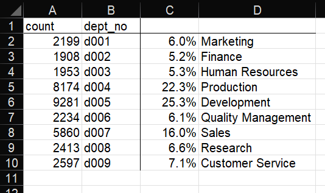

# Pewlett_Hackard_Analysis

## Project Overview
Pewlett-Hackard is a large company of thousands of employees that has been around for a long time. Many babyboomer employees are due to retire in the next few years and we have tasked with analyzing employee data to prepare for the future: employees eligible for retirement packages, hiring needs per department and position, mentorship programs etc. Specifically in this challenge, we are to determine the number of retiring employees per title, and identify employees who are eligible to participate in a mentorship program.

## Results of the Analysis
1. Out of a total workforce of 300,024 at Pewlett-Hackard some 72,458 employees will retire in the next few years (24.2%)
2. About half of the employees retiring are engineers of all levels, as we can see in the 'Retiring Titles' table below, and about a third are senior staff from all departments:

 

3. The three departments that will be most impacted by the 'silver tsunami' are Development (25.3%), Production (22.3%) and Sales (16.0%), as we can see in the 'Retirement by Dept' table below:

 

4.

## Summary

How many roles will need to be filled as the "silver tsunami" begins to make an impact?
Are there enough qualified, retirement-ready employees in the departments to mentor the next generation of Pewlett Hackard employees?
